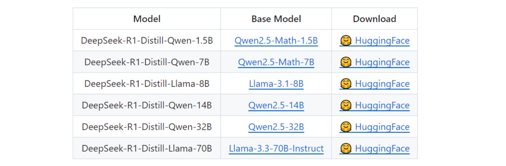
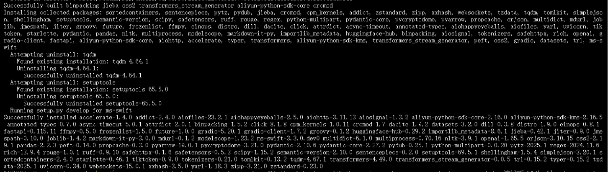
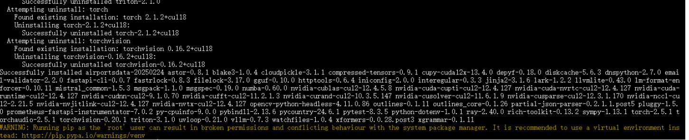
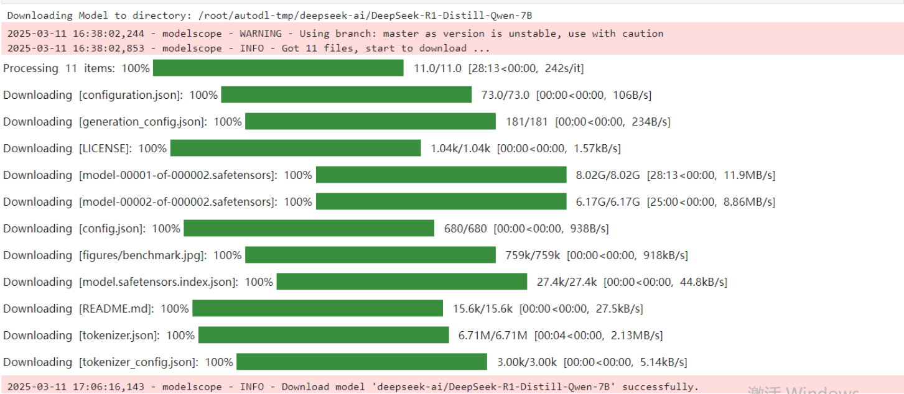
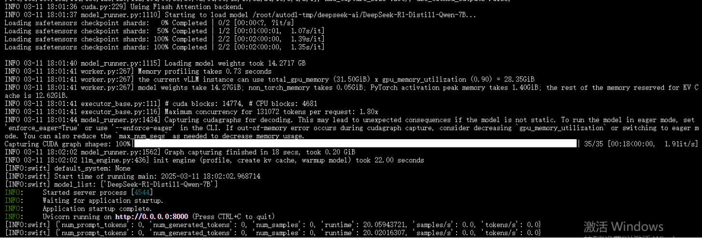
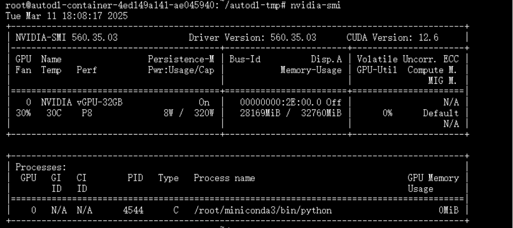
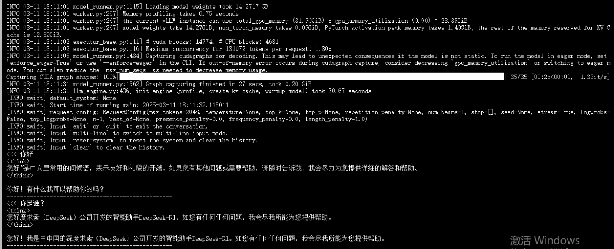
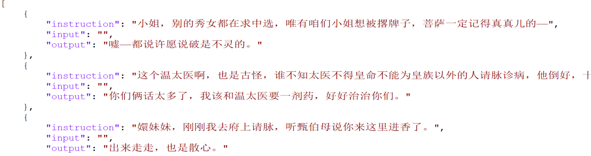
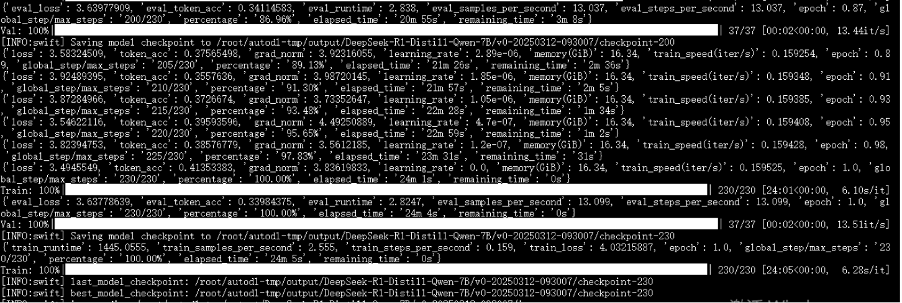
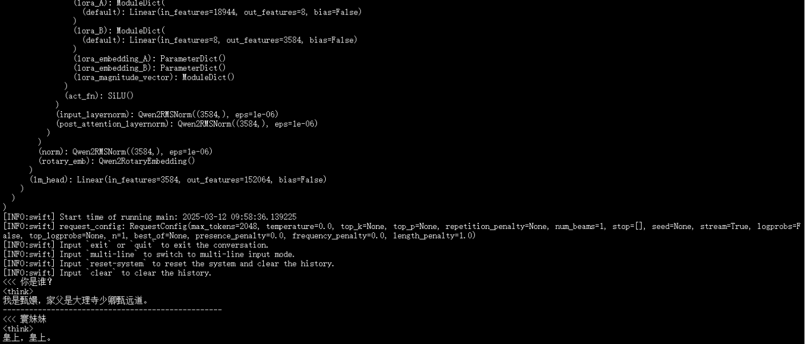

# DeepSeek-R1大模型基于MS-Swift框架部署/推理/微调实践大全
## 一、引言
随着大语言模型（LLM）在自然语言处理（NLP）领域的广泛应用，如何高效部署、推理和微调这些模型成为了一个重要的研究方向。
DeepSeek - R1 作为一款在推理能力方面表现突出的大型语言模型，凭借其独特的架构设计与先进的训练技术，在各类推理任务中脱颖而出。而 MS - Swift 框架则为大模型的高效部署提供了全面且强大的支持，两者结合，为开发者和研究人员提供了极具潜力的技术方案。本文将深入且细致地阐述基于 MS - Swift 框架的 DeepSeek - R1 模型在部署、推理和微调方面的实践操作，帮助大家快速掌握并熟练运用这一技术组合，从而在自然语言处理相关项目中充分发挥其优势。
## 二、MS-Swift 框架简介	
MS - Swift 是一款专为大模型部署而精心打造的高效框架，具备出色的兼容性与丰富的功能特性。在模型类型支持上，无论是专注于文本处理的纯文本模型，还是融合文本、图像、音频等多种信息模态的多模态模型，亦或是擅长文本序列分类任务的序列分类模型，MS - Swift 均能为其提供适配的部署环境。另外在功能层面，MS - Swift 框架提供了基于 Gradio 的 Web UI。Gradio 作为开源的界面构建工具，能够以直观、便捷的方式搭建起用户与模型交互的可视化界面，即便非专业开发人员也能轻松上手，通过简单操作与模型进行对话、输入指令等。

## 三、DeepSeek-R1 模型简介
DeepSeek-R1 是一款专为提升推理能力而设计的大型语言模型。它在自然语言处理领域，尤其是复杂推理任务中表现出色，这得益于其独特的训练方式和优化策略。DeepSeek-R1 采用了强化学习技术，通过与环境的交互不断优化模型的推理能力，使其能够在面对复杂的逻辑推理和多步骤问题时，生成准确且连贯的答案。此外，为了进一步提升模型的实用性和效率，DeepSeek-R1 还结合了蒸馏技术，将大型模型的知识和能力迁移到更小的模型中，从而在保持推理性能的同时，显著降低了资源消耗。
DeepSeek-R1 提供了多种蒸馏版本，以满足不同用户的需求。具体信息如下：

DeepSeek-R1-Distill-Qwen-7B 是一款在资源受限环境下具有突出优势的蒸馏模型。它既不像一些小型模型那样对硬件资源要求极低但推理性能有限，也不像大型模型那样对硬件资源需求较高但能在复杂场景中展现卓越的推理能力。它以适中的参数规模，在保持较为出色的推理性能的同时，能很好地适应普通个人电脑、小型服务器等资源受限的设备，为这些设备提供了高效推理的解决方案，是平衡资源与性能的最佳选择，能够满足大多数对推理效率有一定要求且受限于硬件资源的应用场景。 而其他DeepSeek-R1-Distill-Qwen-14B 和 DeepSeek-R1-Distill-Qwen-32B等更大参数的蒸馏模型，在推理能力上表现更出色，更适合对性能要求较高的复杂场景。

## 四、DeepSeek-R1 部署实践
### 1. 环境准备
在部署 DeepSeek-R1 模型之前，需要准备合适的硬件和软件环境：
操作系统选用Ubuntu 22.04，其稳定性和丰富的软件资源，为AI开发提供了良好的基础。Python版本选择3.10，它在性能和兼容性上表现出色，广泛应用于各类AI项目。同时，安装PyTorch 2.1.2，作为深度学习的核心框架，PyTorch为模型的运行提供了高效的计算库和灵活的编程接口。此外，还需安装Cuda 11.8，它能充分发挥NVIDIA GPU的并行计算能力，加速模型的训练与推理过程。

### 2. 安装swift
```bash
# pip install git+https://github.com/modelscope/ms-swift.git

git clone https://github.com/modelscope/ms-swift.git
cd ms-swift
pip install -e .
```
下载完成如下：

### 3. vllm加速
vLLM 是一个高性能、灵活且易于部署的大语言模型推理框架，适用于需要高效处理大模型的场景。它通过优化的内存管理和高效的调度算法，显著提升了推理效率
```bash
# 临时指定清华源安装（推荐）
pip install vllm -i https://pypi.tuna.tsinghua.edu.cn/simple
# 临时指定阿里源安装（备用）pip install vllm -i https://mirrors.aliyun.com/pypi/simple
```
安装完成如下：

### 4. 模型下载
DeepSeek-R1 的蒸馏版本可以通过 modelscope或者Hugging Face 下载。以下以 DeepSeek-R1-Distill-Qwen-7B 为例：
使用 modelscope 中的 snapshot_download 函数下载模型（提前安装modelscope ：pip install modelscope）。第一个参数为模型名称，参数 cache_dir 用于指定模型的下载路径。在 /root/autodl-tmp 路径下新建 download.ipynb 文件，并在其中输入以下内容：
```python
from modelscope import snapshot_download
model_dir = snapshot_download('deepseek-ai/DeepSeek-R1-Distill-Qwen-7B', cache_dir='/root/autodl-tmp', revision='master')
```
运行代码执行下载，如下：

### 5. 模型部署
使用 MS-Swift 框架，可以通过以下命令启动模型服务：
```bash
CUDA_VISIBLE_DEVICES=0 swift deploy \
    --model /root/autodl-tmp/deepseek-ai/DeepSeek-R1-Distill-Qwen-7B \
    --infer_backend vllm
```
模型部署启动成功如下：

服务启动后，可以通过 HTTP API 访问模型。

我们可以使用cli命令脚本调用模型服务，在终端中输入以下命令：
```bash
curl http://localhost:8000/v1/chat/completions \
-H "Content-Type: application/json" \
-d '{
"model": "DeepSeek-R1-Distill-Qwen-7B",
"messages": [{"role": "user", "content": "用最精炼的语言介绍一下AI大模型"}],
"temperature": 0
}'
```
模型API返回如下：
```bash
{"model":"DeepSeek-R1-Distill-Qwen-7B","choices":[{"index":0,"message":{"role":"assistant","content":"<think>\n好的，我现在要介绍AI大模型。首先，我需要明确什么是AI大模型。AI大模型通常指的是像GPT、BERT这样的大型预训练模型，它们通过大量数据训练，能够处理复杂的自然语言任务。\n\n接下来，我应该解释这些模型的特点，比如它们的规模大、参数多，能够处理多种语言和任务。然后，说明它们的应用领域，比如文本生成、信息检索、对话系统等。\n\n最后，要提到这些模型对社会的积极影响，比如推动创新、提高效率，同时也要注意潜在的挑战，如隐私和伦理问题。\n\n现在，把这些点组织成一个连贯的介绍，语言要简洁明了，适合快速理解。\n</think>\n\nAI大模型是指经过大规模预训练的高级人工智能模型，具备处理复杂语言任务的能力，广泛应用于文本生成、信息检索和对话系统等领域，推动创新和效率提升，同时需注意隐私和伦理挑战。","tool_calls":null},"finish_reason":"stop","logprobs":null}],"usage":{"prompt_tokens":14,"completion_tokens":194,"total_tokens":208},"id":"61a7a02a832d4dd5ba6dd185a9fa417d","object":"chat.completion","created":1741687627}
```
部署推理资源消耗情况如下（28G左右）：


## 五、DeepSeek-R1 推理实践
推理是 DeepSeek-R1 的核心应用场景之一。以下是一个基于 MS-Swift 框架的推理代码示例：
```python
CUDA_VISIBLE_DEVICES=0 swift infer \
    --model /root/autodl-tmp/deepseek-ai/DeepSeek-R1-Distill-Qwen-7B \
    --stream true \
    --infer_backend vllm \
    --max_new_tokens 2048
```
脚本执行成功，推理效果如下：



## 六、DeepSeek-R1 微调实践
微调是提升 DeepSeek-R1 模型性能的重要手段。以下是一个基于 MS-Swift 框架的微调步骤：
### 1、数据集准备
为对DeepSeek-R1-Distill-Qwen-7B模型开展微调，找了一份有趣的数据集（https://github.com/KMnO4-zx/huanhuan-chat），内容如下：

### 2、模型微调训练
以下是一个基于 MS-Swift 框架的lora微调代码示例：
```bash
CUDA_VISIBLE_DEVICES=0 \
swift sft \
    --model '/root/autodl-tmp/deepseek-ai/DeepSeek-R1-Distill-Qwen-7B' \
    --train_type lora \
    --dataset '/root/autodl-tmp/datasets/huanhuan.json' \
    --num_train_epochs 1 \
    --per_device_train_batch_size 1 \
    --learning_rate 1e-4 \
    --lora_rank 8 \
    --lora_alpha 32 \
    --gradient_accumulation_steps 16 \
    --eval_steps 100 \
    --save_steps 100 \
    --save_total_limit 2 \
--logging_steps 5 
```
参数说明：
--model：指定预训练模型的名称或路径
--train_type lora ：指定训练类型为 LoRA（Low-Rank Adaptation），一种高效的微调方法
--dataset ：指定训练数据集的名称或路径
--num_train_epochs：指定训练的总轮数（epoch），这里设置为 1 轮
--per_device_train_batch_size：指定每个设备（GPU）的训练批次大小，这里设置为 1
--learning_rate：设置学习率，这里为 1e-4
--lora_rank：设置 LoRA 的秩（rank），用于控制 LoRA 层的参数数量，这里设置为 8
--lora_alpha：设置 LoRA 的缩放因子 alpha，用于控制 LoRA 层的缩放比例，这里设置为 32
--gradient_accumulation_steps：设置梯度累积步数，用于在小批次情况下模拟大批次训练，这里设置为 16 步
--eval_steps：每隔多少步进行一次评估，这里设置为每 100 步评估一次
--save_steps：每隔多少步保存一次模型，这里设置为每 100 步保存一次
--save_total_limit：保存的模型总数限制，这里最多保存 2 个模型
--logging_steps：每隔多少步记录一次日志，这里设置为每 5 步记录一次
--model_author swift：指定模型作者，这里为 "swift"
--model_name swift-robot：指定保存的模型名称，这里为 "swift-robot"
微调训练结果如下：

微调后生成的新的checkpoint权重文件如下：
/root/autodl-tmp/output/DeepSeek-R1-Distill-Qwen-7B/v0-20250312-093007/checkpoint-230
在微调过程中，建议使用结构化的提示数据，并通过拒绝采样生成更多训练样本。
### 3、推理训练后权重文件
直接加载微调后的权重文件，快速验证微调效果是否生效。
```bash
CUDA_VISIBLE_DEVICES=0 \
swift infer \
    --adapters /root/autodl-tmp/output/DeepSeek-R1-Distill-Qwen-7B/v0-20250312-093007/checkpoint-230 \
    --stream true \
    --temperature 0 \
--max_new_tokens 2048
```
微调效果：

微调训练后的权重文件实际上既包含了主模型的通用知识，也包含了微调后的特定知识，可以通过上面的方式快速查看微调效果。
### 4、LoRA合并&推理训练后的权重文件
不仅加载微调后的权重文件，还通过 LoRA 合并进一步优化推理结果。
```bash
# merge-lora and use vLLM for inference acceleration
CUDA_VISIBLE_DEVICES=0 \
swift infer \
    --adapters /root/autodl-tmp/output/DeepSeek-R1-Distill-Qwen-7B/v0-20250312-093007/checkpoint-230 \
    --stream true \
    --merge_lora true \
    --infer_backend vllm \
    --max_model_len 8192 \
    --temperature 0 \
--max_new_tokens 2048
```
即可得到新的模型权重文件：
/root/autodl-tmp/output/DeepSeek-R1-Distill-Qwen-7B/v0-20250312-093007/checkpoint-230-merged

